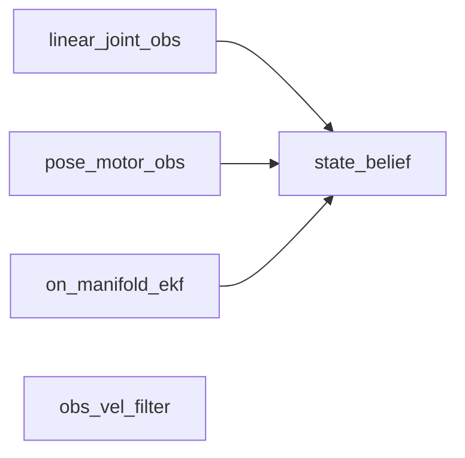
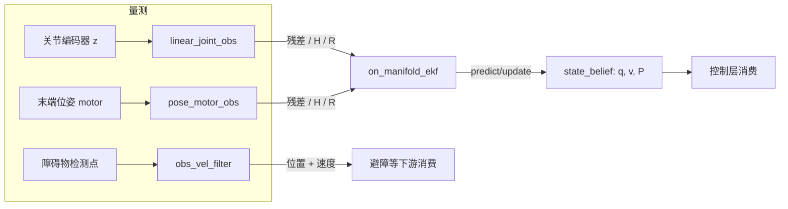

# control-observe —— 控制栈的观测层(估计层)

control 是一组仿神经五层架构的控制 crate 集合,本 crate 是其中的**观测层**:
纯估计,不含被控对象(plant),不含执行引擎(engine)。调用方喂入量测,它返回估计。
以 path 依赖被上层(如 z1-arm)引用,可独立构建、测试与发布。MIT 许可(见 `LICENSE`)。

## 核心设计意图

- **纯估计闭环**:估计器只能由量测驱动。行走仿真没有量测噪声,无法评判估计器,
  因此本 crate 刻意置身腿足回路之外——它由观测基准(bench)来评判,而不是由行走来评判。
- **信念与滤波分离**:`state_belief` 是估计器"被允许知道的一切"(q、v 与 2n×2n 协方差 P);
  `on_manifold_ekf` 只负责在信念上做 predict/update;观测算子(关节编码器、末端位姿)
  只产出三元组 `(残差, 雅可比 H, 噪声 R)`,与 EKF 互不依赖——EKF 的 `update` 只吃原始矩阵。
- **观测矩阵维度诚实**:所有观测雅可比均为标准的 `m × 2n`(m 为量测维数),
  补零只出现在 H 的右半(量测不读速度),不向上补零成方阵,
  因此 `S = H·P·Hᵀ + R` 天然成立,无需截取子块。
- **无 build.rs,无引擎依赖**:估计层就是本 crate 链接的全部内容。

## 模块

| 模块 | 职责 |
| --- | --- |
| `state_belief` | 状态信念:q、v、2n×2n 协方差 P,以及打包向量 x = [q; v] |
| `obs_vel_filter` | 障碍物恒速 Kalman 滤波,状态 [px py pz vx vy vz] |
| `on_manifold_ekf` | 构形流形上的 EKF,状态 x = [q; qd],predict/update 均就地改写信念 |
| `linear_joint_obs` | 关节编码器观测:H = [I_n \| 0],线性 |
| `pose_motor_obs` | 末端位姿观测:以 PGA motor 表示量测,经 `PgaFk` 正解,雅可比用中心有限差分 |

## 模块依赖拓扑(无环)



内部依赖只有三条边,且全部指向 `state_belief`;`state_belief` 不依赖任何内部模块,
`obs_vel_filter` 完全独立。依赖图是 DAG。

## 信号流



## 对外依赖与理由

| 依赖 | 用途 | 理由 |
| --- | --- | --- |
| [`control-math`](../control-math) | `Mat` 稠密矩阵(eye/blocks/mul/inv/symmetrized) | 栈内统一的算术层,估计的全部线性代数都落在它上面 |
| [`control-model`](../control-model) | `PgaFk` 正解模型、`pga_biv_to_axial` | 位姿观测的残差是"预测 motor 与量测 motor 的相对对数",必须由运动学模型给出预测 |
| [`pga`](../pga) | `Multivector`(motor 的 gp/reverse/log) | motor 是 PGA 多重向量,位姿量测 `z` 以此类型进出接口 |

无 dev-dependencies;测试(`tests/observer.rs`)不依赖引擎,Z1 模型经
`control_model::urdf::urdf_path()` 解析(`models/` 归 control-model 所有)。

## 测试

```sh
make test    # 即 mbx test
```

覆盖:障碍物滤波器的恒速跟踪与冷启动播种、EKF 线性更新、位姿观测在自身位姿处的
零残差与雅可比非 NaN、以及确定性噪声流。
